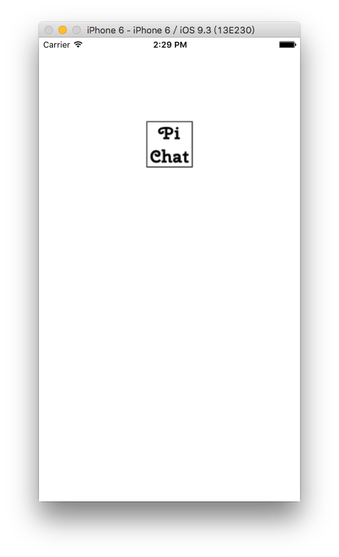
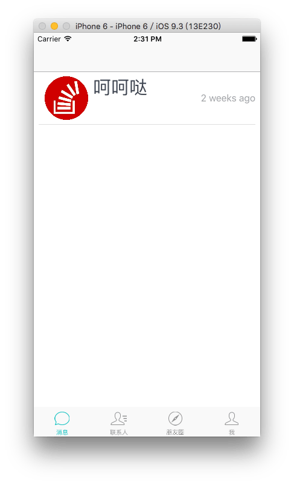
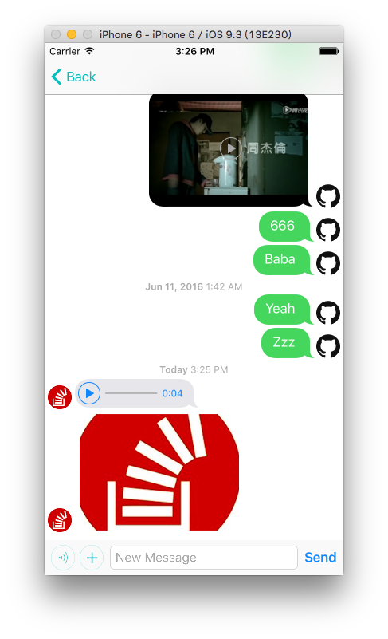
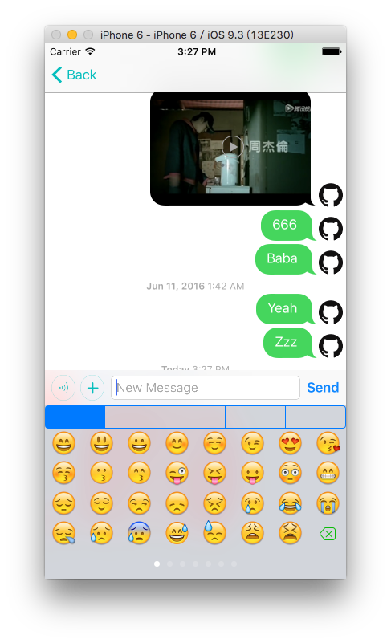
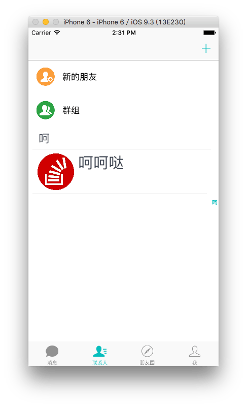
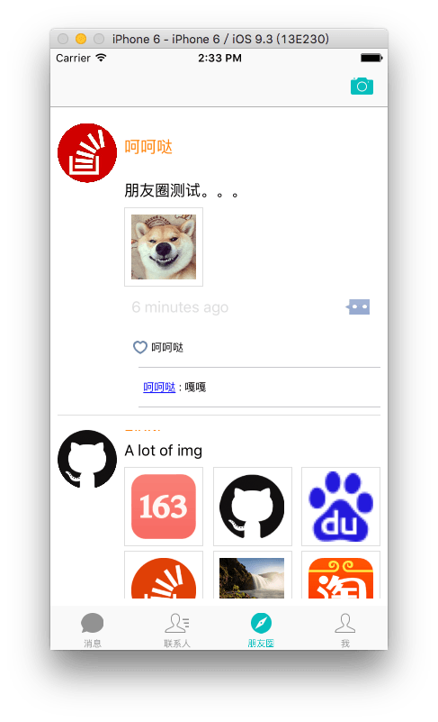
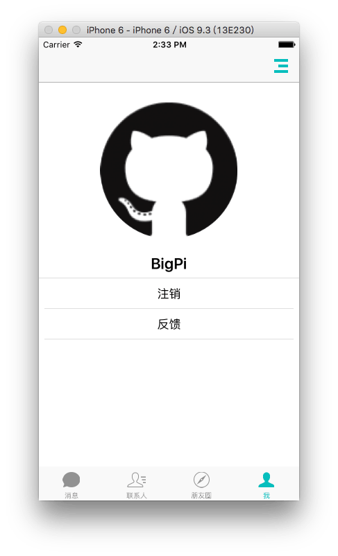

# PiChat

**A Realtime Chat App with LeanCloud as Back-end**

**一个即时聊天 App 基于 LeanCloud.**

---
可以注册账号,也可以使用 App 的2个测试账号

- 账号1 : `1@qq.com` 
- 账号2 :`2@qq.com`
- 密码 : `666`

后台数据请登录 [Leancloud](https://leancloud.cn) 控制台查看

- 账号 `wangdapishuai@163.com`
- 密码 `8PcU2)vnXbY^to`

---

---

- [x] 朋友圈计算 UICollectionview Cell Size (使用 Autolayout),还有小 Bug
- [x] 准备加入 [yapstudios/YapDatabase](https://github.com/yapstudios/YapDatabase) 来缓存网络数据
- [x] [FastImageCache](https://github.com/path/FastImageCache)做图片缓存感觉不错...
- [ ] YYText 源码根本看不懂,全是 Core Text ,感觉它的 Demo 好流畅... 

---
## 使用的第三方库:

**Leancloud**

- pod 'AVOSCloud'
- pod 'AVOSCloudIM'     // IM
- pod 'LeanCloudSocial'  // SNS 登录
- pod 'LeanCloudFeedback' // 问题反馈

**twitter 的 Fabric 的 Crashlytics**

- pod 'Fabric'
- pod 'Crashlytics' //崩溃日志

**其它**

- pod 'JSQMessagesViewController' //聊天消息界面
- pod 'MBProgressHUD'
- pod 'Masonry'
- pod 'GJAlertController'
- pod 'IQKeyboardManager'
- pod 'DateTools'
- pod 'MWPhotoBrowser'       //视频,图片浏览器
- pod 'MJRefresh'
- pod 'SCSiriWaveformView'
- pod 'QBImagePickerController'  //图片选择
- pod 'DGActivityIndicatorView'
- pod 'JSBadgeView'   //小红点
- pod 'RealReachability'
#
- pod 'YapDatabase'   //本地缓存
- pod 'FastImageCache' //图片缓存
- pod 'Reveal-iOS-SDK', :configurations => ['Debug']

---
#License
[GNU GPLv3](./LICENSE)